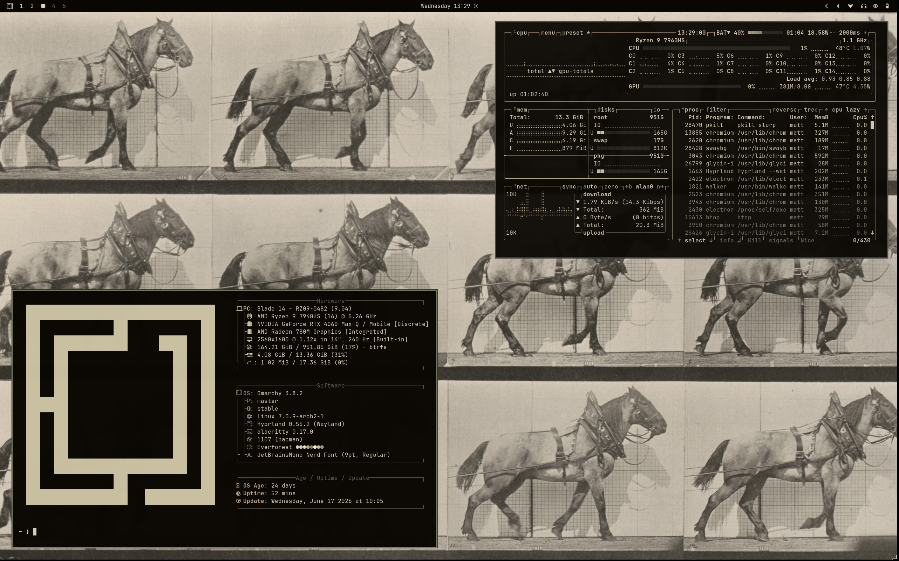

# Omarchy Eadweard Muybridge Theme

A dark Omarchy theme inspired by the motion photography of Eadweard Muybridge.

     



## Inspiration

Eadweard Muybridge (1830–1904) was an English photographer best known for his revolutionary motion studies, documenting the movement of humans and animals through carefully sequenced photographs. His work bridged art, science, and the beginnings of film.

I chose this collection for its restrained palette of sepia, charcoal, and warm ivory. Combined with subtle olive accents, the colors create a desktop that feels calm, focused, and reminiscent of early photographic prints.

## Wallpaper Gallery

This theme includes seven carefully selected motion photographs:

| Preview | Artwork |
| --- | --- |
|  | Bactrian Camel Galloping (1887) |
|  | Billy Hauling (1887) |
|  | Deer Galloping (1887) |
|  | Elk Galloping (1887) |
|  | Lion Walking (1887) |
|  | Miner (1887) |
|  | Walking and Turning Around Rapidly (1887) |

## Color Palette
### Backgrounds


### Warm Neutrals


### Olive Accents


### Highlights


## Components

- Aether
- Alacritty
- btop
- Chromium
- Foot
- Ghostty
- Hyprland
- Kitty
- Neovim
- Omarchy Shell (bar, lock screen, notifications, launcher, on-screen display)
- Vencord
- VS Code
- Warp
- Zellij

## Installation

Clone the repository into your Omarchy themes directory:

```bash
omarchy-theme-install https://github.com/mattbbia/stills-in-motion-omarchy.git
```
### OR

1. Open the Omarchy menu (**Super + Alt + Space**).
2. Go to **Install > Style > Theme**.
3. Paste this repo URL: `https://github.com/mattbbia/stills-in-motion-omarchy.git`
4. Hit Enter.

## Contributing

Contributions, bug reports, feature requests, and suggestions are always welcome. Feel free to open an issue or submit a pull request.

## Support

If you enjoy this theme and would like to support future themes, you can:

- ⭐ Star this repository
- 💡 Suggesting new themes
- ☕ Supporting future themes

[](https://buymeacoffee.com/mattbbia)

## Acknowledgements

All photography by Eadweard Muybridge is in the public domain. The high-resolution source images used in this theme were obtained from [National Gallery of Art](https://www.nga.gov/) and are included here for appreciation and preservation of public-domain art.

## License

This project is licensed under the MIT License. See the LICENSE file for details.
